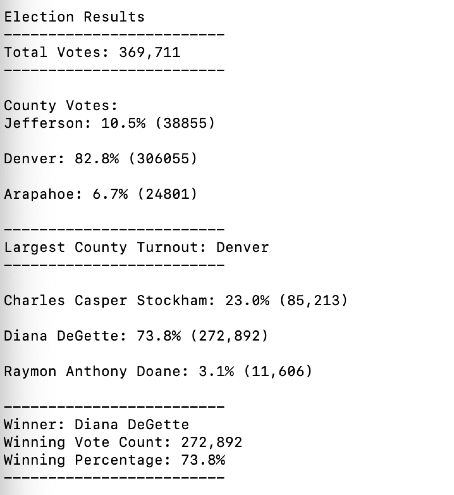

# Election_Analysis

## Overview of Project
The purpose of this analysis is to help board of election employee Tom in an
election audit of the tabulated results for US Congressional predict in Colorado.
And we are going to report the total number of votes cast, the total number of
votes for each candidate, the percentage of votes for each candidate, and the
winner of the election based on the popular vote. Moreover, we are going to finish
this task through python, we need to read a .csv file through python and count
these results.

### Purpose
By doing this analysis, we are able to clearly see the results of votes in each
states. And we can use the results we get to generate a vote count report to
certify the US congressional race. And we are able to learn how to read, write,
and extract data from CSV file through python. And we are able to get familiar
with how to use python to create repetition loops in python.

## Analysis and Challenges
It's weird to read the .csv file through a programming language and we can create
a .txt file just by opening it in the python code. I spent a lot of time on getting
familiar with python and the csv files.

### Challenges and Difficulties Encountered

I have used python before, so there are not challenges and difficulties encountered.

## Election-Audit Results

- There are 369711 votes in this congressional election.

- The county were:
  - Jefferson: 10.5% (38855)
  - Denver: 82.8% (306055)
  - Arapahoe: 6.7% (24801)

- The county results were:
  - Jefferson received 10.5% of the votes and 38855 number of votes
  - Denver received 82.8% of the votes and 306055 number of votes
  - Arapahoe received 6.7% of the votes and 24801 number of votes

- The winner county of the election was:
  - Denver, which county received 82.8% of the votes and 306055 number of votes

________________________________________________________________________________

- The candidate were:
  - Charles Casper Stockham: 23.0% (85,213)
  - Diana DeGette: 73.8% (272,892)
  - Raymon Anthony Doane: 3.1% (11,606)

- The candidate results were:
  - Charles Casper Stockham received 23.0% of the votes and 85,213 number of votes
  - Diana DeGette received 73.8% of the votes and 272,892 number of votes
  - Raymon Anthony Doane received 3.1% of the votes and 11,606 number of votes

- The winner candidate of the election was:
  - Diana DeGette, who received 73.8% of the votes and 272,892 number of votes

## Election-Audit Summary

This script can be used to verify the result of county votes and candidate votes.
Since most election is doing the work of counting votes, therefore, we can simply
change the .csv file of reading and also create a new txt file of writing the
result. However, reading the csv file is kind of hard coded, because we know
the position of each county and candidate, but we can later to first open the .CSV
file but automatically search for the correct names for each part will be perfect.
for example, we can read through a new csv file to first find titles and save
the titles and count the total number for each title. therefore, we can easily
open a new csv file in any other election csv file.
Moreover, the print and writing of the script is also hardcoded, we can modifiy
it by changing the name for example county in the script to a saved variable Which
we have saved the name when we are trying yo read through the csv file.
